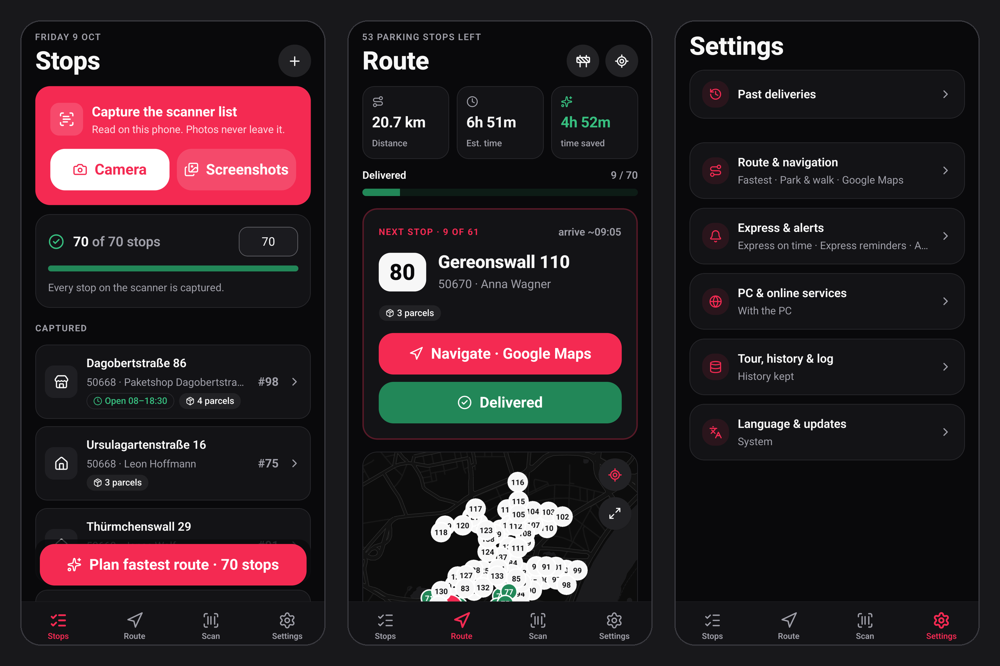
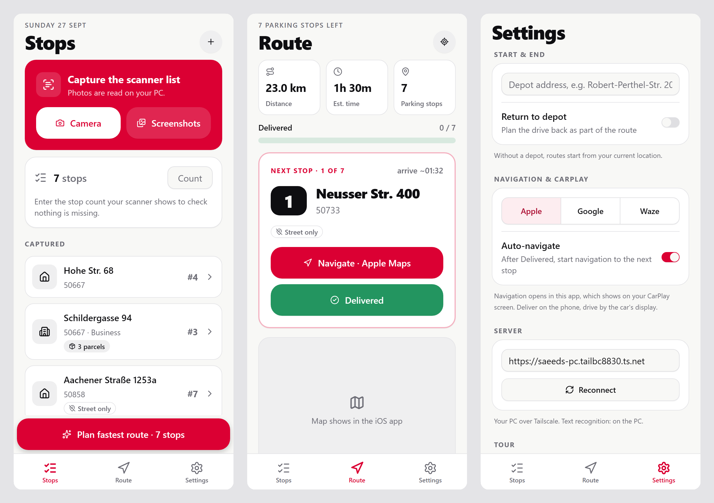
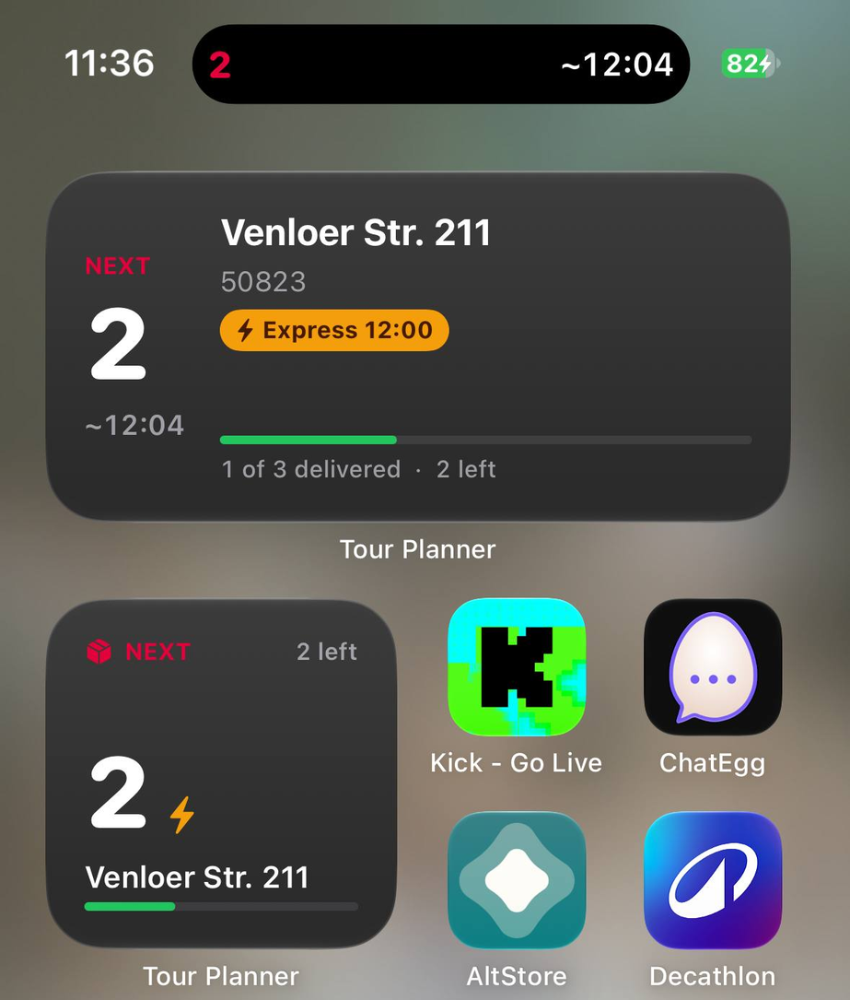
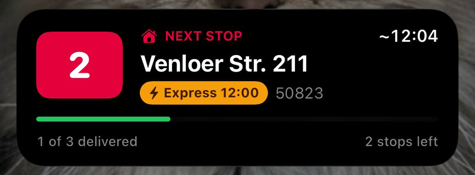
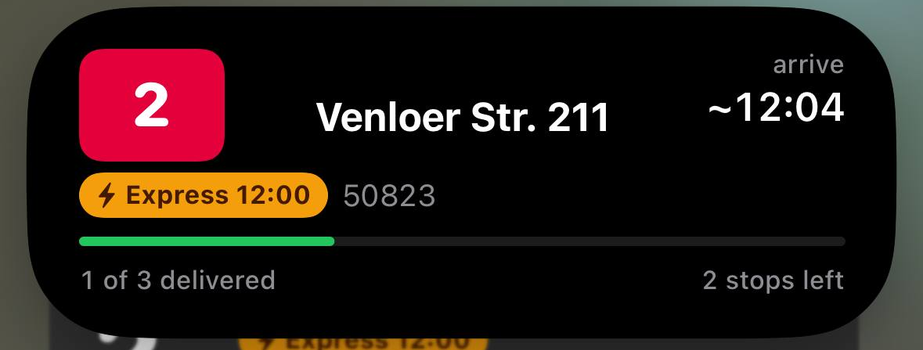

# Tour Planner

Photograph a DPD scanner's stop list; get the fastest delivery order, grouped into park-and-walk stops, with loading numbers and one-tap navigation. The iPhone app (Expo / React Native) and a web app both use one self-hosted backend on a home PC, reached privately over Tailscale.

<p align="center">
  
</p>

<details>
<summary>Light mode</summary>
<p align="center"></p>
</details>

<sub>Screens at iPhone size (390 pt), rendered from the app's web build; on iOS the map area shows Apple Maps, on Android MapLibre with OpenFreeMap tiles.</sub>

Glanceable on a real iPhone: the next stop as a Live Activity (Lock Screen, Dynamic Island, CarPlay Dashboard) and Home Screen widgets.

<p align="center">
  
  <br>
  
</p>

```
iPhone (Apple Vision OCR) ─┐                       ┌─ local vision model (Qwen3-VL-8B)  ─fallback─► Claude
web app (photos) ──────────┼─► server/ (Node, :3000) ┤─ Photon geocoder      (WSL, :2322)
        Tailscale HTTPS ───┘                       └─ VROOM → OSRM, Köln road graph (WSL, :3001 / :5050)
```

## Run

```powershell
./start.ps1              # WSL routing services + app server
npm test                 # backend self-check
cd mobile; npm test; npm run typecheck; npm run lint
```

- Open `https://<your-pc>.<your-tailnet>.ts.net` on any device on the tailnet (or `http://localhost:3000`).
- **One-time setup**: `wsl -u root bash wsl/setup.sh deps`, then `wsl bash wsl/setup.sh build`. This downloads the map and the Photon DB and builds VROOM.

## Languages

English and German. The app follows the phone's language (iOS and Android also list it under per-app languages) and can be switched under Settings > Language. The web app follows the browser and has an EN/DE toggle in the header. Texts live in `mobile/src/shared/locales/*.json` and `public/locales/*.json`; app code only ever imports `@/shared/i18n` (a lint rule enforces it), so the library behind it can change in one place.

## Layout

| Path | What |
|---|---|
| `server/main.mjs`, `server/api.mjs` | HTTP entry point and routes (thin) |
| `server/extract/` | photo/text → stops: prompts + schema, appliance and Claude providers, text grounding |
| `server/route/` | stop identity, geocoding, park-and-walk clustering, VROOM/OSRM solve, the plan use case |
| `server/log.mjs` | structured logs → `data/logs/YYYY-MM-DD.jsonl` (server, web and iOS in one file) |
| `public/` | web app: markup, CSS, one ES module per concern |
| `mobile/` | Expo Router app: `src/app` routes · `src/features` (tour, settings) · `src/services` (scan, location, navigation) · `src/shared` (UI, logging) |
| `wsl/` | routing stack setup and start scripts |
| `.github/workflows/ios-unsigned.yml` | unsigned iOS `.ipa` built on GitHub's macOS runners |
| `.github/workflows/android-apk.yml` | release APK (debug-signed) built on GitHub's Linux runners |
| `CONTEXT.md`, `docs/adr/` | glossary and decisions |

## iPhone app

Expo SDK 57 · React Native 0.86 · Expo Router · **NativeWind 4 + React Native Reusables** (shadcn/ui for React Native) · lucide icons · Reanimated · haptics · light/dark.

- **Stops**: a capture hero (camera or screenshots, read on the phone with Apple Vision), a check of the stop count against the scanner, and stop rows that open a focused edit dialog.
- **Route**: stats, delivery progress, and a *Next stop* card with driver-sized **Navigate** and **Delivered** buttons. Below it: the map (draggable pins), the upcoming list, and a collapsed delivered list.
- **CarPlay (no CarPlay entitlement or paid account needed)**: see [CarPlay](#carplay) below.
- **Architecture**: `src/features/tour` holds a framework-free store and pure selectors (unit-tested with `node --test`), `useDelivery` / `usePlanning` hooks, and small components. `src/components/ui` holds the Reusables primitives we own and extend (e.g. `Button` `xl` and `success`).
- **Design preview on Windows**: `npx expo start --web`. The map is replaced by a placeholder on web.

## CarPlay

A CarPlay app of its own needs an entitlement Apple grants only to paid accounts. The following works without one (iOS 26+):

| On the car screen | How |
|---|---|
| **Turn-by-turn to the next stop** | *Navigate* opens Apple Maps, Google Maps or Waze, which all run on CarPlay. With *Auto-navigate*, tapping *Delivered* goes straight on to the next stop. |
| **"Next stop" Live Activity** | Loading number, address, Express time and stops left. It's on the CarPlay Dashboard automatically (plus Lock Screen and Dynamic Island), and updates as you deliver. See `mobile/src/widgets/NextStopActivity.tsx`. |
| **"Next stop" widget** | A small widget you can add to CarPlay's widget screen; tapping it opens the Route tab. |
| **Voice: "Hey Siri, delivered" / "Hey Siri, next stop"** | Siri Shortcuts calling the server (below). They work hands-free with the phone locked, speak the next stop and open navigation to it. |

**Set up the two Siri Shortcuts** in the iPhone's Shortcuts app (+ → Add Action):

1. **Get Contents of URL** → `https://<your-pc>.<your-tailnet>.ts.net/siri/delivered?app=apple` (tap *Show More*, Method **POST**). Use `app=google` or `app=waze` to navigate with those apps.
2. **Get Dictionary Value** → key `speech` → **Speak Text**.
3. **Get Dictionary Value** → key `url` from *Contents of URL* → **Open URLs**.
4. Name it **Delivered**. Duplicate it, change the URL to `/siri/next` (Method **GET**), and name the copy **Next stop**.

Settings needed: *Siri → Allow Siri When Locked*, and Tailscale on the iPhone set to stay connected (VPN On Demand). Deliveries made by voice show up in the app, the Live Activity and the web app the next time the app opens.

## Fresh road data

The stop order is computed on a self-hosted OpenStreetMap graph. It's kept current four ways; driving itself runs in Google Maps / Waze, which already use their own live closures and traffic.

| Source | When | Effect |
|---|---|---|
| **OpenStreetMap** (Geofabrik's Regierungsbezirk Köln extract, updated daily) | every night at 03:30 | new signs, one-ways, turn restrictions and new roads mapped by the community |
| **City of Cologne roadworks** ([open data](https://offenedaten-koeln.de/dataset/baustellen-koeln), ~870 relevant permits) | at startup and 05:30 | road/sewer/emergency works slowed to 5 km/h, utility/markings/lights works to 15 km/h. Permits are points without a "fully closed" flag, so they steer the route away rather than forbid a street. |
| **City of Cologne traffic calendar** ([Verkehrskalender](https://ckan.open.nrw.de/dataset/verkehrsbeeintrachtigungen-stadt-koln-k), ~110 active entries) | at startup and 05:30 | entries active today, read from their text: "in beide Fahrtrichtungen / voll gesperrt" is a closure (0 km/h); "in Fahrtrichtung X gesperrt" is 5 km/h (a point can't say which direction); narrowings and events 15 km/h. |
| **What you report** (cone button on the Route tab) | instantly (~5 s) | **Closed**: the street at your position, 0 km/h for 14 days. **No entry this way**: point the phone the way you may not drive; that direction only is closed, for 180 days, until OSM catches up with the new one-way. The rest of the tour is re-planned. Reports with no drivable road within 20 m are refused. |

All of it lives in `server/roads/` and `wsl/osrm.sh`. Every apply rebuilds the routing graph from a pristine copy (`map-base/`): `osrm-customize` writes speeds into the graph files, so re-weighting in place kept removed closures and ended roadworks. Two copies of the graph run: `:5050` for routing (re-weighted) and `:5051` untouched, which the server snaps closure points against. On the re-weighted graph, routes avoid slowed streets and can't cross closed ones. Google's traffic-aware matrix was considered and rejected: about $50–100 per tour day (`docs/adr/0004`).

## iPhone install without a Mac or paid account

1. Download `TourPlanner-unsigned.ipa` from the latest [GitHub Release](../../releases/latest) (or from a workflow run's artifacts).
2. On Windows, install **Sideloadly** and iTunes, plug in the iPhone, drop in the `.ipa`, and sign in with a free Apple ID.
3. On the iPhone: Settings → General → VPN & Device Management → trust your Apple ID. Also enable Developer Mode.
4. Free signing expires after 7 days. Re-sideload the same `.ipa` weekly.

## Android install

Download `TourPlanner.apk` from the latest [GitHub Release](../../releases/latest) (or from an **Android APK** workflow run's artifacts). Install with `adb install -r TourPlanner.apk`, or copy the file to the phone and open it.

## Releases

Every push to `main` runs `release.yml`: [semantic-release](https://semantic-release.gitbook.io) reads the commits since the last tag and, if any of them is releasable, builds the APK and the IPA with that version stamped into `app.json`, tags, and publishes a GitHub Release with the notes and both files attached. Commit messages follow [Conventional Commits](https://www.conventionalcommits.org): `feat:` bumps the minor version, `fix:` the patch, a `!` after the type or a `BREAKING CHANGE:` footer the major. Anything else (`chore:`, `docs:`, `refactor:`, ...) ships with the next release but does not trigger one. The Android APK and iOS workflows can still be run by hand for a test build.

## Logs

[Pino](https://getpino.io) writes every request, reader decision (appliance vs Claude, timings), geocode miss, plan, pin, tick-off and client error to `data/logs/app.<date>.<n>.jsonl`. Files roll daily, and 30 days are kept. Each line is one JSON object with `level`, `t`, `src` (`server`/`web`/`ios`), `scope`, `msg` and details. Clients queue logs on the device and upload them, so logs written offline arrive later.

```powershell
Get-Content (ls data/logs/app.*.jsonl | sort LastWriteTime)[-1] -Wait | ConvertFrom-Json | Format-Table t,level,src,scope,msg
```
