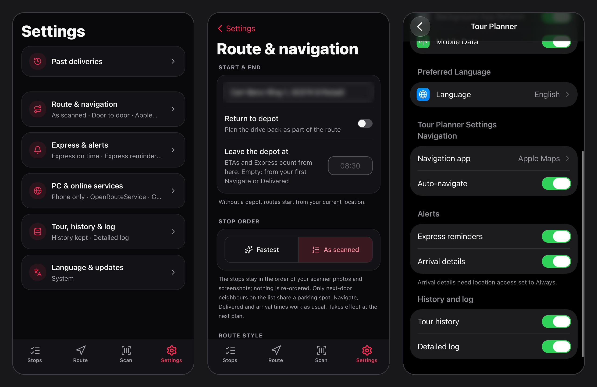
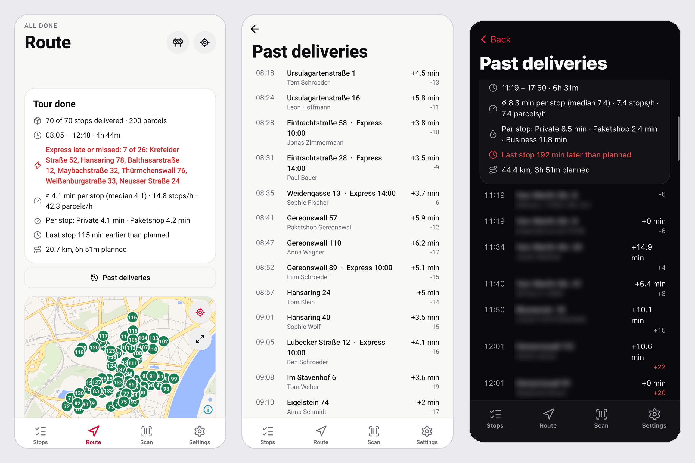

# Tour Planner

Photograph a DPD scanner's stop list; get the fastest delivery order, grouped into park-and-walk stops, with loading numbers and one-tap navigation. The phone app (Expo / React Native, iPhone and Android) and a web app both use one self-hosted backend on a home PC, reached privately over Tailscale.

<p align="center">
  
</p>

<details>
<summary>Light mode</summary>
<p align="center"></p>
</details>

<sub>The Android build with a sample tour (made-up names on Cologne streets); on iOS the map is Apple Maps.</sub>

<p align="center"> &nbsp; </p>

<sub>The opening animation and the icon, "Delivered road": light, dark and tinted on iOS, adaptive and themed on Android.</sub>

Settings in groups, and the same switches in the phone's own Settings app (shown on a real iPhone):

<p align="center"></p>

A summary when the tour is done, and every past day with the time each stop took, kept on the phone for a year (the right-hand screen is a real day, its addresses blurred):

<p align="center"></p>

Glanceable on a real iPhone: the next stop as a Live Activity (Lock Screen, Dynamic Island, CarPlay Dashboard) and Home Screen widgets.

<p align="center">
  
  <br>
  
</p>

```
phone (Apple Vision / ML Kit OCR) ─┐               ┌─ local vision model (Qwen3-VL-8B)  ─fallback─► Claude
web app (photos) ──────────────────┼─► server/ (Node, :3000) ┤─ Photon geocoder      (WSL, :2322)
        Tailscale HTTPS ───────────┘                       └─ VROOM → OSRM, Köln road graph (WSL, :3001 / :5050)
```

The order respects how a van actually moves: one-way streets and turn restrictions from the road graph, each street driven once (the van stops on its side and you cross on foot, instead of a second pass for the other side; or always at the door's kerb, if you prefer), no coming back to a stretch of street already done, each stop parked on its own street rather than the nearer alley round the corner, and, when you re-plan on the move, the direction you are already driving ([ADR 6](docs/adr/0006-drive-each-street-once.md)).

Don't want the app to re-order anything? **Settings › Stop order › As scanned** keeps the stops exactly as your scanner photos and screenshots list them, with the same navigation, Delivered button and arrival times.

## Run

```powershell
./start.ps1              # WSL routing services + app server
npm test                 # backend self-check
cd mobile; npm test; npm run typecheck; npm run lint
```

- Open `https://<your-pc>.<your-tailnet>.ts.net` on any device on the tailnet (or `http://localhost:3000`).
- **One-time setup**: `wsl -u root bash wsl/setup.sh deps`, then `wsl bash wsl/setup.sh build`. This downloads the map and the Photon DB and builds VROOM.

## Languages

English and German. The app follows the phone's language (iOS and Android also list it under per-app languages) and can be switched under Settings > Language. The web app follows the browser and has an EN/DE toggle in the header. Texts live in `mobile/src/shared/locales/*.json` and `public/locales/*.json`; app code only ever imports `@/shared/i18n` (a lint rule enforces it), so the library behind it can change in one place.

## Layout

| Path | What |
|---|---|
| `server/main.mjs`, `server/api.mjs` | HTTP entry point and routes (thin) |
| `server/extract/` | photo/text → stops: prompts + schema, appliance and Claude providers, text grounding |
| `server/route/` | stop identity, geocoding, park-and-walk clustering, VROOM/OSRM solve, the plan use case |
| `server/log.mjs` | structured logs → `data/logs/YYYY-MM-DD.jsonl` (server, web, iOS and Android in one file) |
| `public/` | web app: markup, CSS, one ES module per concern |
| `mobile/` | Expo Router app: `src/app` routes · `src/features` (tour, settings) · `src/services` (scan, location, navigation) · `src/shared` (UI, logging) |
| `wsl/` | routing stack setup and start scripts |
| `.github/workflows/ios-unsigned.yml` | unsigned iOS `.ipa` built on GitHub's macOS runners |
| `.github/workflows/android-apk.yml` | release APK (debug-signed) built on GitHub's Linux runners |
| `CONTEXT.md`, `docs/adr/` | glossary and decisions |

## Phone app (iPhone and Android)

Expo SDK 57 · React Native 0.86 · Expo Router · **NativeWind 4 + React Native Reusables** (shadcn/ui for React Native) · lucide icons · Reanimated · haptics · light/dark. One code base builds both apps; the differences are listed further down.

- **Stops**: a capture hero (camera or screenshots, read on the phone with Apple Vision on iOS and ML Kit on Android, with a "3 / 12" progress line), a check of the stop count against the scanner, and stop rows that open a focused edit dialog.
- **Planning on the phone** (no PC): addresses go to Apple's or Google's geocoder first; one it cannot place (a street named after a town, like *Neusser Str.*, comes back as the town) goes to OpenStreetMap's public [Photon](https://photon.komoot.io), checked by the PC's rules (same street, near the postcode, else a neighbouring number, else the street). Road times come from OpenStreetMap's public router.
- **Route**: stats, delivery progress, and a *Next stop* card with driver-sized **Navigate** and **Delivered** buttons. Below it: stops the plan could not place (tap to fix the address; navigate there by address; tick off), the map (draggable pins), the upcoming list, and a collapsed delivered list. Without a *Leave the depot at* time, arrival times count from your first **Navigate** or **Delivered**, not from when you planned.
- **Scan**: parcel labels, for loading numbers and the right parcel at the door.
- **Settings**, in groups: *Route & navigation* (depot, stop order *Fastest* or *As scanned*, route style and *Both sides in one pass*, navigation app), *Express & alerts* (*on time* with a buffer of 0–20 min, *Express first*, reminders before each deadline, arrival details), *PC & online services* (PC or phone-only planning, road-time keys), *Tour, history & log* and *Language & updates*. The everyday switches also appear in the phone's own Settings app: a Tour Planner page on iOS, the app-info "settings" link on Android.
- **Tour done and Past deliveries**: when the last stop is delivered, a summary (time on the road, minutes per stop by type, stops and parcels per hour, Express missed, against the plan); every day is kept for a year in the app's documents, untouched by *Clear cache*, with each stop's time, searchable by street or name.
- **Opening animation**: a van drives the icon's road and the screen splits open along it (Reanimated, on the UI thread); a plain fade with *Reduce Motion*.
- **CarPlay (no CarPlay entitlement or paid account needed)**: see [CarPlay](#carplay) below.
- **Architecture**: `src/features/tour` holds a framework-free store and pure selectors (unit-tested with `node --test`), `useDelivery` / `usePlanning` hooks, and small components. `src/components/ui` holds the Reusables primitives we own and extend (e.g. `Button` `xl` and `success`).
- **Design preview on Windows**: `npx expo start --web`. The map is replaced by a placeholder on web.

What differs between the two platforms:

| | iPhone | Android |
|---|---|---|
| Map on the Route tab | Apple Maps | MapLibre with OpenFreeMap tiles (no key, no billing) |
| Turn-by-turn | Apple Maps or Google Maps | Google Maps, started straight into navigation |
| On-device OCR | Apple Vision | ML Kit |
| Next stop outside the app | Live Activity, widgets, CarPlay Dashboard, Siri | not available |
| Install | sideload the `.ipa` (see below) | install the `.apk` (see below) |

## CarPlay

A CarPlay app of its own needs an entitlement Apple grants only to paid accounts. The following works without one (iOS 26+):

| On the car screen | How |
|---|---|
| **Turn-by-turn to the next stop** | *Navigate* opens Apple Maps, Google Maps or Waze, which all run on CarPlay. With *Auto-navigate*, tapping *Delivered* goes straight on to the next stop. |
| **"Next stop" Live Activity** | Loading number, address, Express time and stops left. It's on the CarPlay Dashboard automatically (plus Lock Screen and Dynamic Island), and updates as you deliver. See `mobile/src/widgets/NextStopActivity.tsx`. |
| **"Next stop" widget** | A small widget you can add to CarPlay's widget screen; tapping it opens the Route tab. |
| **Voice: "Hey Siri, delivered" / "Hey Siri, next stop"** | Siri Shortcuts calling the server (below). They work hands-free with the phone locked, speak the next stop and open navigation to it. |

**Set up the two Siri Shortcuts** in the iPhone's Shortcuts app (+ → Add Action):

1. **Get Contents of URL** → `https://<your-pc>.<your-tailnet>.ts.net/siri/delivered?app=apple` (tap *Show More*, Method **POST**). Use `app=google` or `app=waze` to navigate with those apps.
2. **Get Dictionary Value** → key `speech` → **Speak Text**.
3. **Get Dictionary Value** → key `url` from *Contents of URL* → **Open URLs**.
4. Name it **Delivered**. Duplicate it, change the URL to `/siri/next` (Method **GET**), and name the copy **Next stop**.

Settings needed: *Siri → Allow Siri When Locked*, and Tailscale on the iPhone set to stay connected (VPN On Demand). Deliveries made by voice show up in the app, the Live Activity and the web app the next time the app opens.

## Fresh road data

The stop order is computed on a self-hosted OpenStreetMap graph. It's kept current four ways; driving itself runs in Google Maps / Waze, which already use their own live closures and traffic.

| Source | When | Effect |
|---|---|---|
| **OpenStreetMap** (Geofabrik's Regierungsbezirk Köln extract, updated daily) | every night at 03:30 | new signs, one-ways, turn restrictions and new roads mapped by the community |
| **City of Cologne roadworks** ([open data](https://offenedaten-koeln.de/dataset/baustellen-koeln), ~870 relevant permits) | at startup and 05:30 | road/sewer/emergency works slowed to 5 km/h, utility/markings/lights works to 15 km/h. Permits are points without a "fully closed" flag, so they steer the route away rather than forbid a street. |
| **City of Cologne traffic calendar** ([Verkehrskalender](https://ckan.open.nrw.de/dataset/verkehrsbeeintrachtigungen-stadt-koln-k), ~110 active entries) | at startup and 05:30 | entries active today, read from their text: "in beide Fahrtrichtungen / voll gesperrt" is a closure (0 km/h); "in Fahrtrichtung X gesperrt" is 5 km/h (a point can't say which direction); narrowings and events 15 km/h. |
| **What you report** (cone button on the Route tab) | instantly (~5 s) | **Closed**: the street at your position, 0 km/h for 14 days. **No entry this way**: point the phone the way you may not drive; that direction only is closed, for 180 days, until OSM catches up with the new one-way. The rest of the tour is re-planned. Reports with no drivable road within 20 m are refused. |

All of it lives in `server/roads/` and `wsl/osrm.sh`. Every apply rebuilds the routing graph from a pristine copy (`map-base/`): `osrm-customize` writes speeds into the graph files, so re-weighting in place kept removed closures and ended roadworks. Two copies of the graph run: `:5050` for routing (re-weighted) and `:5051` untouched, which the server snaps closure points against. On the re-weighted graph, routes avoid slowed streets and can't cross closed ones. Google's traffic-aware matrix was considered and rejected: about $50–100 per tour day (`docs/adr/0004`).

## iPhone install without a Mac or paid account

1. Download `TourPlanner-unsigned.ipa` from the latest [GitHub Release](../../releases/latest) (or from a workflow run's artifacts).
2. On Windows, install **Sideloadly** and iTunes, plug in the iPhone, drop in the `.ipa`, and sign in with a free Apple ID.
3. On the iPhone: Settings → General → VPN & Device Management → trust your Apple ID. Also enable Developer Mode.
4. Free signing expires after 7 days. Re-sideload the same `.ipa` weekly.

## Android install

Download `TourPlanner.apk` from the latest [GitHub Release](../../releases/latest) (or from an **Android APK** workflow run's artifacts). Install with `adb install -r TourPlanner.apk`, or copy the file to the phone and open it from the Files app. Android 7 or newer; the APK contains all four CPU types.

If the phone says the package is invalid, the download is usually incomplete: the file must be the size shown on the release page. On Samsung phones with One UI 6 or newer, turn off *Auto Blocker* under Settings › Security and privacy for the installation, and allow installs from the Files app when asked.

## Releases

Every push to `main` runs `release.yml`: [semantic-release](https://semantic-release.gitbook.io) reads the commits since the last tag and, if any of them is releasable, builds the APK and the IPA with that version stamped into `app.json`, tags, and publishes a GitHub Release with the notes and both files attached. Commit messages follow [Conventional Commits](https://www.conventionalcommits.org): `feat:` bumps the minor version, `fix:` the patch, a `!` after the type or a `BREAKING CHANGE:` footer the major. Anything else (`chore:`, `docs:`, `refactor:`, ...) ships with the next release but does not trigger one. The Android APK and iOS workflows can still be run by hand for a test build.

## Logs

[Pino](https://getpino.io) writes every request, reader decision (appliance vs Claude, timings), geocode miss, plan, pin, tick-off and client error to `data/logs/app.<date>.<n>.jsonl`. Files roll daily, and 30 days are kept. Each line is one JSON object with `level`, `t`, `src` (`server`/`web`/`ios`/`android`), `scope`, `msg` and details. Clients queue logs on the device and upload them, so logs written offline arrive later.

The phone also keeps its own log (`logs/app.jsonl` in the app's documents, a few MB), which matters in phone-only mode, where nothing reaches the PC. **Settings › Log › Export log** shares it as one text file: a header (app version, phone, settings without the server address or keys), the day's tour, the tour history, then every entry. Turn on **Detailed log** first to also record the why: each address lookup and what each geocoder answered, what the phone read from each photo, and how the order came about.

**Tour history** (on by default, Settings › Log) keeps one record per day on the phone (`history/<date>.json`, 120 days): every stop with its place in the scanner list and on the plan, the scanner's area letters and route code, when it was delivered, and where the phone was at that Delivered tap (one reading per tap, no background tracking). Nothing plans by it yet; it's the data for learning the driver's own area (ADR 7).

```powershell
Get-Content (ls data/logs/app.*.jsonl | sort LastWriteTime)[-1] -Wait | ConvertFrom-Json | Format-Table t,level,src,scope,msg
```
